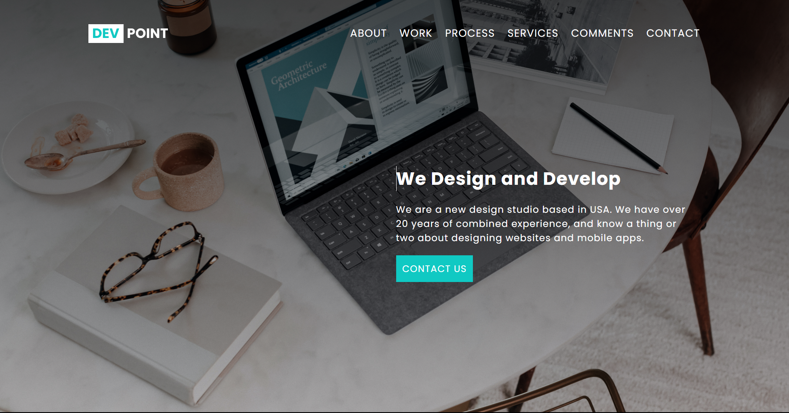
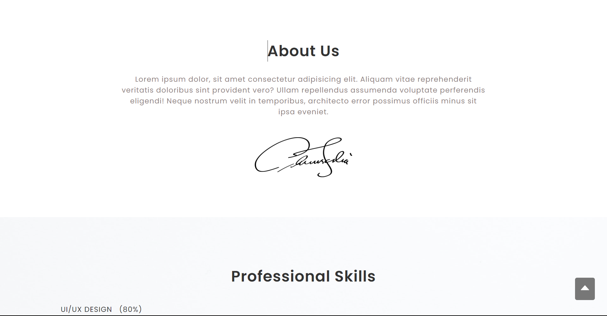
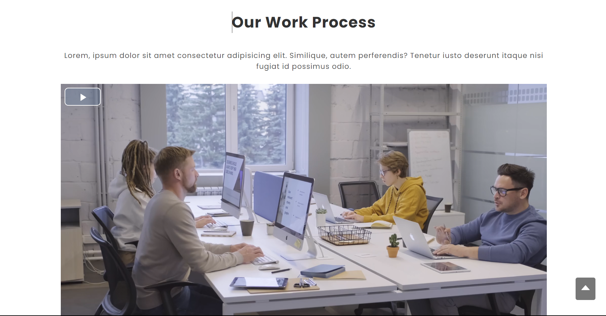
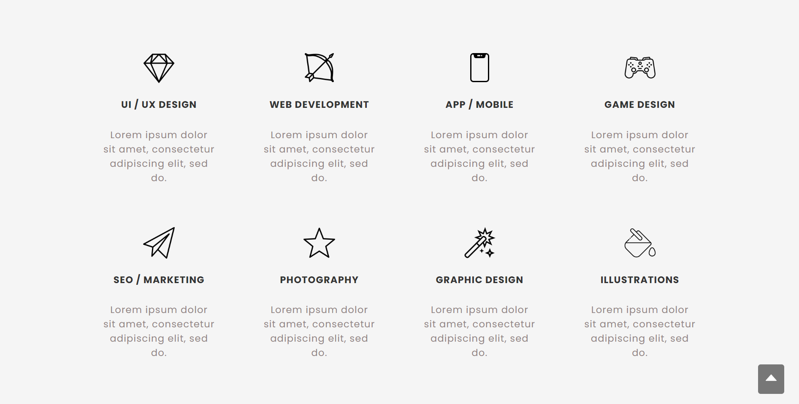
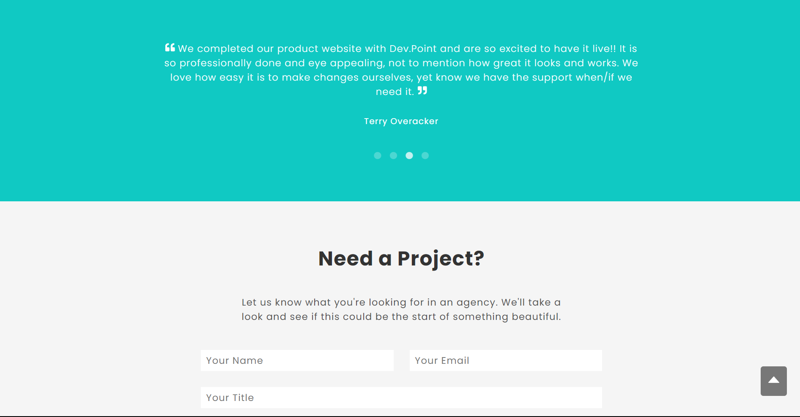
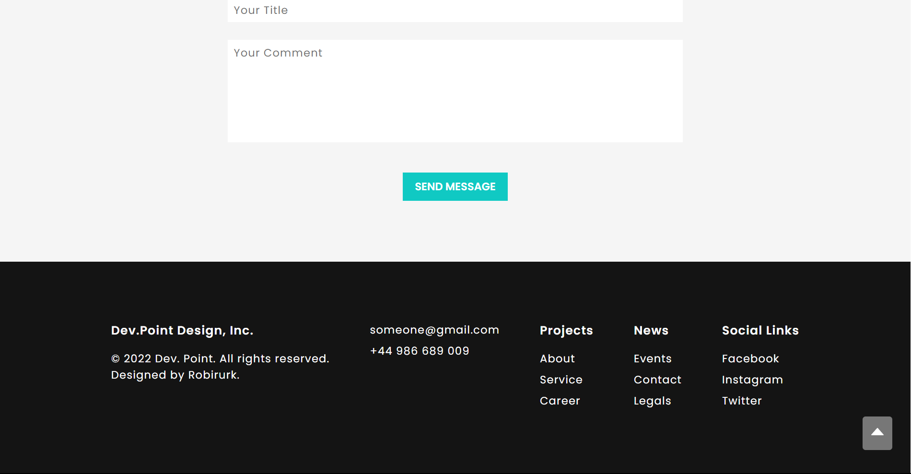

# Webpage-Practicing-By-Using-React.js

## Introduction

This is a simple website made in React. The idea of website is taken [Here](https://github.com/prabinmagar/devpoint-react-js-simple-website-for-beginners).

## Interface of the webpage

Home page:  
  
About page:  
  
Sills page:  
  
Works page:  
  
  
Process page:  
  
Services page:
  
Comment and contact form:  
  
Footer:  

## Installation

### To view the website fully, follow these steps:

<strong>Step 1</strong>: Download the project.  
<strong>Step 2</strong>: Using PowerShell or a terminal, navigate to the project directory and run `npm i` to install all the necessary packages for the project.  
<strong>Step 3</strong>: Run `npm run dev` and open the local host link in your browser to view the website.
